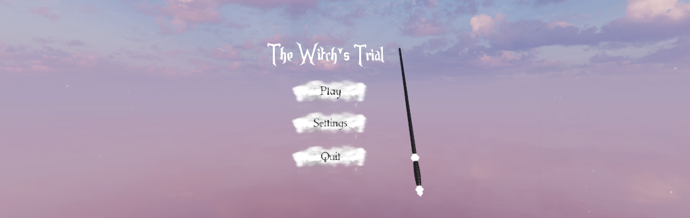

# The Witch's Trial
#### Final graduation VR project

## Introduction
This is my graduation project for Holberton School, a project-based, peer learning full stack software engineering school. I created a little VR game in which the player becomes a witch and will have to pass a trial to prove their worth as one. If failed, the witch will have her powers removed and live as a simple human (You shall not worry I am sure you can pass 😉).

## Description
The game is set up in a beautiful fantasy world, full of magic and different creatures. The player, whom is a witch, will go through multiple tests (levels). Each test is timed and is different from the other as it evaluates everytime an ability of the witch.

_This game is designed to have multiple levels, because of time scope only one has been made for now. more will come in the future._

## Level one : Flying trial
For the first test, the witch has to reach the final line within the time limit and have collected 10 diamonds by flying on a broom.
The course is made up of :
- **Pink rings :** Adds 3 seconds to the timer.
- **Red rings :** Substracts 5 seconds from the timer.
- **Asteroids :** If bumped into them, a dimaond is taken from the witch.

## Level one : Flying trial
For the first test, the witch has to reach the final line within the time limit and have collected 10 diamonds by flying on a broom.
The course is made up of :
- **Pink rings :** Adds 3 seconds to the timer.
- **Red rings :** Substracts 5 seconds from the timer.
- **Asteroids :** If you bumped into them, a dimaond is taken from the witch.

## Tech used
* Unity 2019.4.21f1 (64-bit)
* Occulus Integration

## Game demo
You can watch my game demo [here](https://youtu.be/mfttqPEolg4) 🥰

## Free assets used
* [Witchcraft and Wizardry Asset Pack](https://assetstore.unity.com/packages/3d/props/free-witchcraft-and-wizardry-asset-pack-141428)
* [Elemental Magic Totems](https://assetstore.unity.com/packages/3d/elemental-magic-totems-59522)
* [Magic VFX – Ice ](https://assetstore.unity.com/packages/vfx/particles/spells/magic-vfx-ice-free-170242)
* [Effect textures and prefabs](https://assetstore.unity.com/packages/vfx/particles/effect-textures-and-prefabs-109031)
* [RPG Music Pack: Lite Edition](https://assetstore.unity.com/packages/audio/music/rpg-music-pack-lite-edition-149931)
* [Magical Music Album](https://assetstore.unity.com/packages/audio/music/magical-music-album-040618-117907)
* [3D Game Kit - Environment Pack](https://assetstore.unity.com/packages/3d/3d-game-kit-environment-pack-135167)
* [Evil Dragon Pack HP](https://assetstore.unity.com/packages/3d/characters/creatures/evil-dragon-pack-hp-79398)
* [Flying Tree](https://assetstore.unity.com/packages/3d/environments/fantasy/flying-tree-33053)
* [Fantasy Skybox FREE](https://assetstore.unity.com/packages/2d/textures-materials/sky/fantasy-skybox-free-18353)
* [SpaceSkies Free](https://assetstore.unity.com/packages/2d/textures-materials/sky/spaceskies-free-80503)
* [Simple Gems Ultimate Animated Customizable Pack](https://assetstore.unity.com/packages/3d/props/simple-gems-ultimate-animated-customizable-pack-73764)
